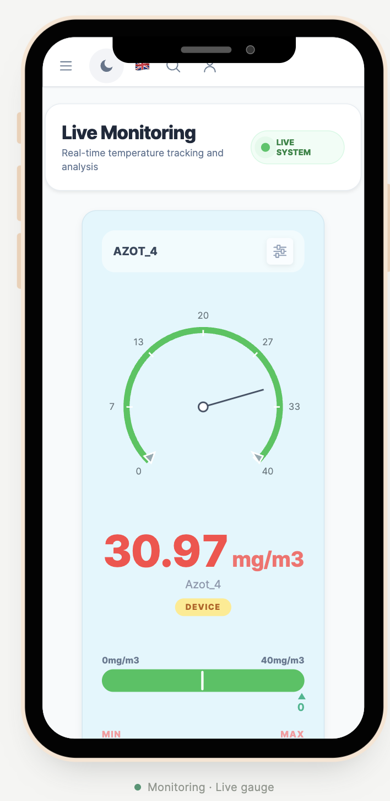

# CST demo mobile app

An offline, interactive HTML reconstruction of the CST mobile application shown in the engineering report.

<div align="center">
  <video src="https://raw.githubusercontent.com/imemdev/cst-demo-mobile-app/feat/cst-demo-mobile-app/assets/demo-run-focus.mp4" controls width="360" aria-label="CST mobile app full demo in Focus mode"></video>
  <p><strong>Two-minute interactive demo · Focus mode</strong></p>
</div>

The tour operates the real HTML controls: it types into inputs, submits forms, saves local records, assigns sensors and contacts, creates a device, and opens monitoring. It is not a screenshot slideshow.

<details>
<summary>Quick setup</summary>

1. Open [`index.html`](index.html) directly in a browser.
2. Select **Focus mode**.
3. Select **Run full demo**.

</details>

The app runs directly from disk, including its fonts and images. No install, account, server or internet connection is required. The report's **17 mobile states are rebuilt as HTML controls**, with a CSS phone frame and SVG map/gauge. No screenshot is rendered as an application screen.

## Preview



## Presenting

- **Run full demo** types into the real forms, triggers validation, saves local records, assigns a sensor and contact, creates a device, and opens monitoring. The tour covers all 17 states, then demonstrates animated readings with a wider gauge range.
- **Pause / Resume**, **Stop** and **Speed** control the tour. Stop leaves the current screen available for manual interaction. Changing a screen from the library stops the tour.
- **Focus mode** hides the surrounding controls to emphasize the phone. Exit focus to restore them.
- The left library opens any report state directly, including filled forms, validation failures and expanded dropdowns.
- The phone menu moves between application features. On the alert list, scroll to its top to reveal the menu.
- The Android-style shell reserves a 54px status bar and a 48px bottom navigation area. **Back** dismisses a dialog, menu, dropdown or edit form before returning to the parent screen; **App home** opens the dashboard; **App navigation** opens the existing feature menu. These controls stop an active tour and never leave the demo. Home/menu remain on login until sign-in.
- The status bar uses a fixed presentation time (9:41) and simulated signal/battery indicators. They do not read the host device. Frame sizes and safe areas are editable in `css/tokens.css`.
- **Reset demo** restores the original local fixtures and clears edits. Reloading the file also resets everything.

## Project structure

```text
mobile-demo/
  index.html                  Entry point and presentation controls
  assets/                     Original logo, warehouse photo, Inter font
  css/
    tokens.css                Shared colors, typography and motion preference
    shell.css                 Presenter layout and CSS phone frame
    components.css            Forms, tables, buttons, dialogs and navigation
    screens.css               Screen-specific layout matching the report
  js/
    data.js                   Report fixtures and the 17-state library
    store.js                  Local CRUD, validation and gauge calculations
    icons.js                  Reusable inline SVG icons
    ui.js                     Shared HTML component functions and escaping
    screens/
      auth.js                 Authentication view
      lists.js                Shared filtering and pagination
      users.js                User list and editing
      companies.js            Company list and form
      rooms.js                Room list and sensor/contact assignment
      devices.js              Device list and nested sensor forms
      monitoring.js           Vector map, alert filters and SVG gauge
    app.js                    Navigation, form actions and local state
    tour.js                   Presentation choreography using actual controls
  docs/screens.md              Report-to-screen coverage and known differences
  tests/                      Core behavior and screen-rendering checks
  scripts/check.cjs            JavaScript and linked-asset check
```

The scripts load in dependency order using `defer`. They share the small `window.CST` namespace, so the app also works under `file://` without module-loading restrictions. Screen functions receive state and return HTML; they do not own persistence. `app.js` handles actions and passes validated records to the store. `tour.js` clicks and fills those same controls rather than swapping images or bypassing saves.

## Demo video

[Download the two-minute Focus-mode demo video](https://raw.githubusercontent.com/imemdev/cst-demo-mobile-app/feat/cst-demo-mobile-app/assets/demo-run-focus.mp4)

To change a color, edit `css/tokens.css`. To change a field, edit its view in `js/screens/` and its validation in `js/store.js`. To change initial records or the screen library, edit `js/data.js`. To change the automatic sequence, edit `steps` in `js/tour.js`.

## Local simulation boundaries

This is a presentation app, not a connection to the real CST backend. Login checks input format only, accepts any sample email and a password of at least four characters, and never persists or transmits the password. All records exist in memory. No account is created, no mail is sent, and no device is contacted.

Initial names and visible values come from the report. Truncated user emails remain truncated in list fixtures; the new-user example uses `medim@example.test`. Additional records and animated measurements are demonstration data.

The map is an editable vector reconstruction of the Sfax port image, not a geographic tile service. Location picking stores a normalized position in this schematic. The screenshot shows a value of 31.06 with a gauge scale of −100 to −40; that inconsistent source state is preserved initially, with the needle clamped to the scale end. The tour explicitly changes the scale to 0–40 for the animated-reading extension.

## Checks

With Node installed:

```sh
npm test
npm run check
```

These commands use only Node built-ins; there are no package dependencies to install. The tests cover local creation/edit/reset, nested device data, required fields, invalid numeric ranges, HTML escaping, alert/site filtering, SVG marker movement, and rendered controls. Phone navigation tests exercise the app's click handlers with a minimal DOM adapter, including overlay dismissal, parent navigation, saved-data preservation and the login boundary. They do not prove browser layout or end-to-end tour playback.

The agent's browser URL policy blocked navigation to the new local file during implementation. Browser visual comparison, keyboard interaction and complete presentation playback therefore require a manual check by opening `index.html`.

## Asset provenance

- `assets/cst-logo.svg`: `Qatar-F3S-FRONTEND/public/images/logo/logo-text.svg`
- `assets/warehouse.png`: `Qatar-F3S-FRONTEND/public/images/apps/home/authentification-background-960x1080.png`
- `assets/inter.woff2`: `Qatar-F3S-FRONTEND/public/fonts/inter/Inter-roman.var.woff2`

The source frontend was read only. Neither the report nor the earlier Flutter and screenshot demos were modified.
